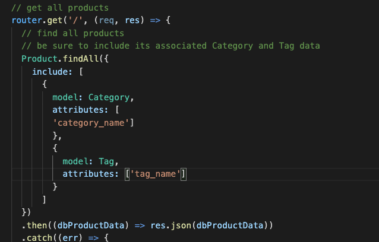
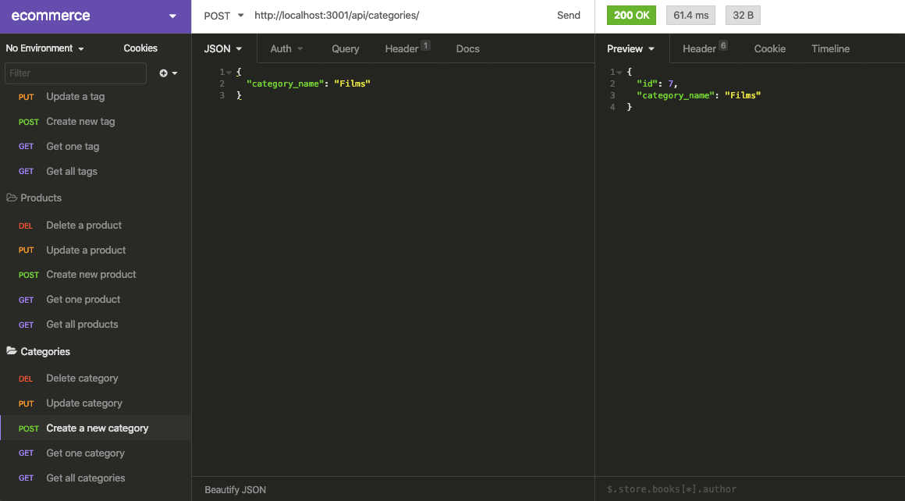
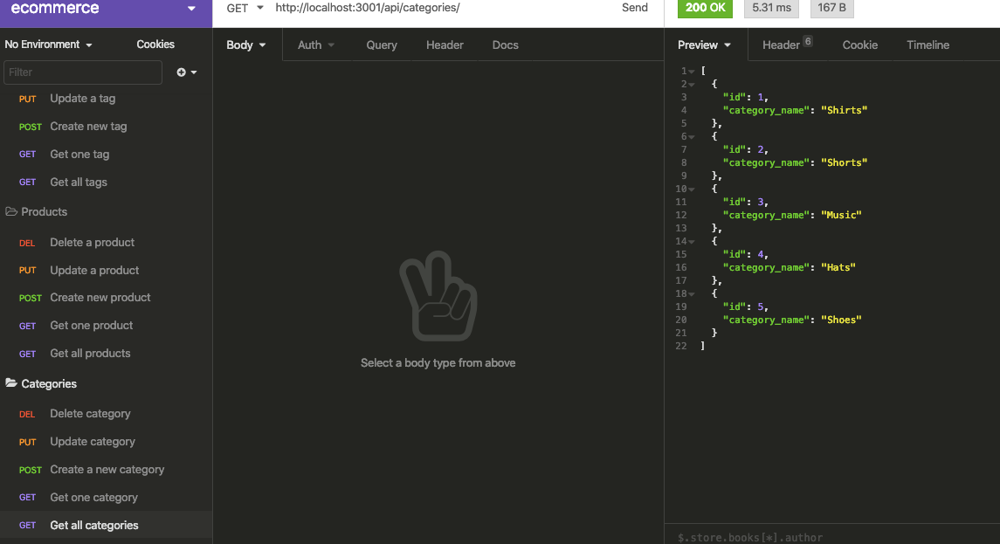

# E-Commerce

## Purpose
User is able to keep track of inventory through a database that lists different categories and products.  User can create, update, delete different categories, products, and tags.

## Built With
* JavaScript
* Node
* Express
* Mysql
* Sequelize

## Installation
install node packages mysql2, sequelize, and Dotenv.

## Contribution
Made by Jon Prine

## Video Walkthrough
https://drive.google.com/file/d/14WbeHU_d7Bb_RIsFvgHXA0A_RyA-avAE/view

## Screenshots of Finished Page

